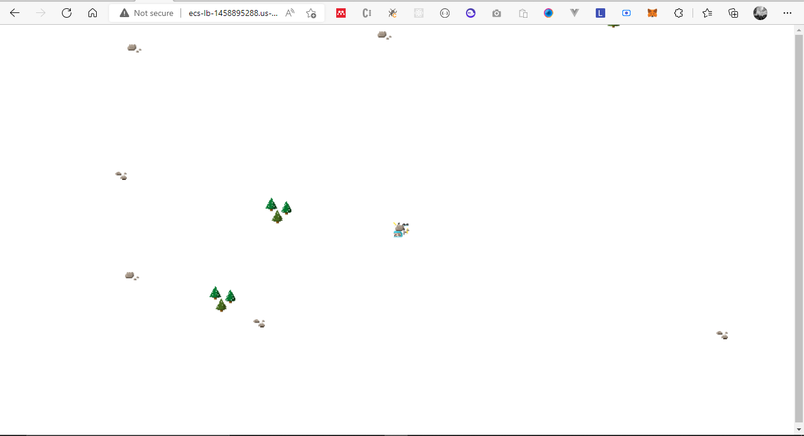

## Optimization steps

- Refactor for stagging and production environment
- Modularized terraform resources
- Utilize s3 backend and Dynamo db for multi state management
- Implement best practices for file/folder structure

```
- production
  - network
    - main.tf
    - variable.tf
    - output.tf
  - compute
    - main.tf
    - variable.tf
    - output.tf
    

- staging 
  - network
  - compute

- s3_backend
  -main.tf

```

### network

 Contains Networking resources such as vpc, subnets, etc

### computes

  Contains Computing resources such as loaad balancers, bastion host, ecs cluster, etc

## Initial loaded game before optimization

</img>
